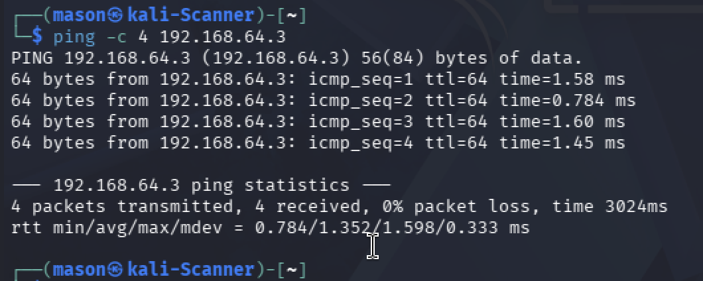
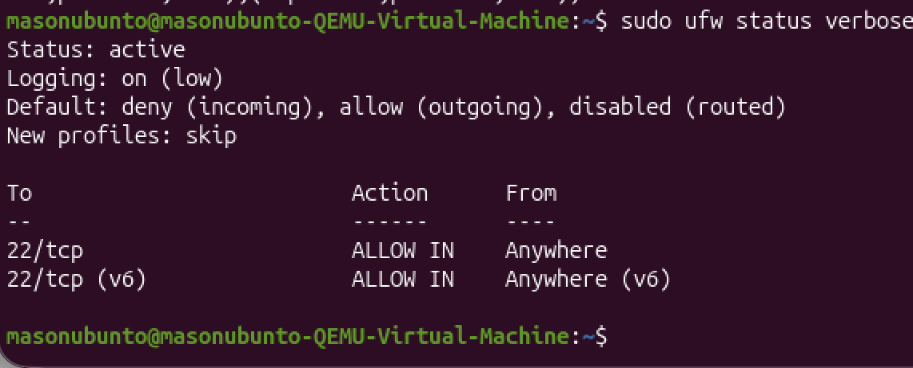
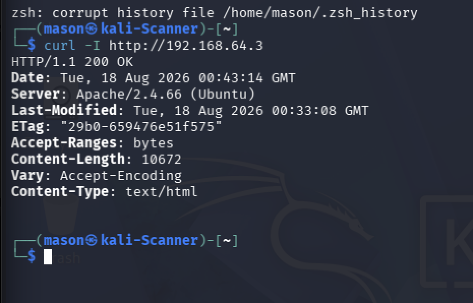
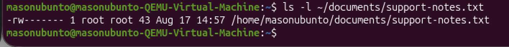
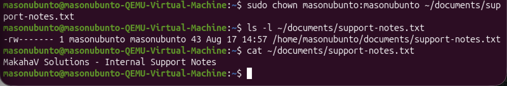
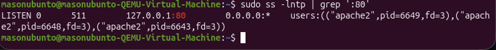
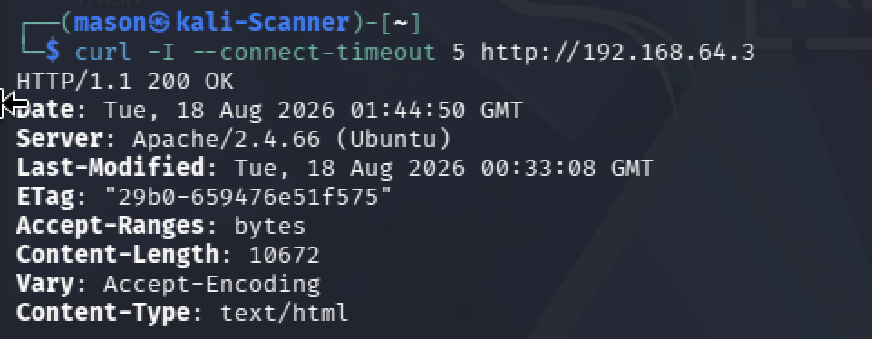
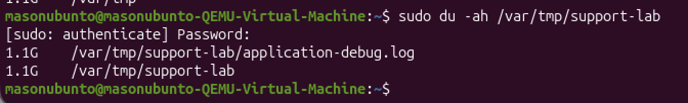
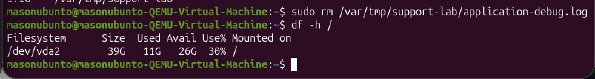

# IT Troubleshooting & Ticket Simulation Homelab

## Project Overview

This project simulates realistic entry-level IT support tickets in an isolated virtual lab environment. The goal was to practice a structured troubleshooting process rather than immediately applying fixes, with an emphasis on identifying symptoms, developing and testing theories, determining root causes, implementing appropriate solutions, and verifying functionality afterward.

The lab focuses on practical Linux and network troubleshooting while reinforcing concepts relevant to CompTIA A+ and foundational cybersecurity skills.

Four simulated support tickets were investigated:

- Internal web service inaccessible from another workstation
- User unable to access a file due to incorrect ownership
- Web service running locally but unavailable to remote systems
- Unexpected disk-space consumption caused by an oversized log file

---

## Lab Environment

| System | Role | Platform |
|---|---|---|
| 🟢 **UBUNTU-TARGET** | System being supported and intentionally misconfigured | Ubuntu Linux, UTM/QEMU ARM VM |
| 🔴 **KALI-SCANNER** | Technician workstation used for remote connectivity and service testing | Kali Linux, UTM/QEMU ARM VM |
| **Host** | Virtualization platform | Apple Silicon MacBook (M2) |

The two lab VMs communicated over a private virtual network in the `192.168.64.0/24` subnet.

### Lab Topology

```text
             UTM/QEMU Virtual Network
                  192.168.64.0/24

     🔴 KALI-SCANNER              🟢 UBUNTU-TARGET
       192.168.64.4  ───────────►  192.168.64.3
       Technician                    Supported System
       Workstation

             Connectivity testing
             Service testing
             Troubleshooting
```

---

## Known-Good Network Baseline

Before intentionally introducing faults, connectivity between the two systems was verified to establish a known-good baseline.

The systems received addresses on the same `/24` subnet:

- 🟢 **UBUNTU-TARGET:** `192.168.64.3/24`
- 🔴 **KALI-SCANNER:** `192.168.64.4/24`
- **Default gateway:** `192.168.64.1`

Bidirectional ICMP testing confirmed that the VMs could communicate normally. Internet connectivity, routing, and DNS resolution were also tested from the Ubuntu target.

Establishing a known-good state provided a reference point for later troubleshooting and helped distinguish newly introduced faults from pre-existing network problems.

### Baseline Connectivity Verification



---

## Troubleshooting Methodology

Each simulated ticket followed the CompTIA troubleshooting methodology:

1. **Identify the problem** — reproduce the reported symptom and determine its scope.
2. **Establish a theory of probable cause** — develop likely explanations based on the available evidence.
3. **Test the theory** — perform targeted diagnostic tests rather than making unrelated changes.
4. **Establish a plan and implement the solution** — correct the identified root cause while avoiding unnecessary changes.
5. **Verify full system functionality** — reproduce the original user use case after the fix.
6. **Document findings, actions, and outcomes** — record the root cause, corrective action, and verification results.

A key objective throughout the project was to avoid blindly applying fixes. A command completing successfully was not considered sufficient verification; the original user-facing functionality also had to be tested.

---

# Simulated Support Tickets

## Ticket #1 — Internal Web Service Unreachable

### User Report

> The internal server cannot be reached, although external network connectivity appears to be working.

### Identify the Problem

Initial connectivity testing showed that the Ubuntu target could communicate over the network and reach external IP addresses.

Remote HTTP testing from 🔴 **KALI-SCANNER**, however, could not reach the web service on 🟢 **UBUNTU-TARGET**.

This narrowed the issue from a general network outage to a problem affecting the HTTP service.

### Investigation

Listening services were inspected using Linux socket and service-management tools.

Apache was initially unavailable on the target system, so the Apache HTTP server was installed and its service status verified.

After installation:

- Apache was `active (running)`.
- TCP port `80` was listening.
- Remote HTTP requests still could not reach the server.

The host firewall was then inspected with UFW.

The firewall was active with a default policy of denying incoming connections. SSH on TCP/22 was explicitly allowed, but HTTP on TCP/80 was not.

### Root Cause

The Ubuntu firewall did not contain an inbound rule allowing HTTP traffic on TCP port `80`.

As a result, Apache could be running correctly while remote clients were still unable to reach it.

### Resolution

An appropriate UFW rule was added to permit HTTP traffic:

```bash
sudo ufw allow 80/tcp
```

### Root-Cause Evidence



### Verification

The service was retested remotely from 🔴 **KALI-SCANNER**.

A request to the Ubuntu target returned:

```text
HTTP/1.1 200 OK
```



### Ticket Resolution

The internal web service was unavailable remotely despite the host having working network connectivity. Apache was installed and verified as running, after which firewall inspection showed that UFW permitted SSH but did not allow inbound HTTP traffic. TCP/80 was explicitly permitted, and a remote HTTP request from the technician workstation successfully returned `HTTP/1.1 200 OK`.

### Key Lesson

A running service does not automatically mean the service is reachable. Troubleshooting should distinguish between the application, listening socket, network connectivity, and firewall policy.

---

## Ticket #2 — User Cannot Access a File

### User Report

> The user can see `support-notes.txt` in their Documents directory but receives a permission error when attempting to open it.

### Identify the Problem

The issue was reproduced from the affected user account:

```text
Permission denied
```

Because the file existed but could not be read, the investigation focused on Linux ownership and permissions.

### Investigation

File metadata was inspected with:

```bash
ls -l ~/documents/support-notes.txt
```

The result showed:

```text
-rw-------  root  root  ... support-notes.txt
```

The logged-in user was `masonubunto`, while the file was owned by `root`.

The permission mode `600` means:

```text
rw- --- ---
 │   │   │
 │   │   └── Others: no access
 │   └────── Group: no access
 └────────── Owner: read/write
```

Because `root` owned the file, the normal user did not receive the owner permissions and therefore could not read it.

### Root Cause

The file had incorrect ownership of `root:root` while retaining restrictive `600` permissions.

The permissions themselves were appropriate for a private file; they were simply being applied to the wrong owner.

### Root-Cause Evidence



### Resolution

Rather than weakening security with an overly permissive mode such as `777`, ownership was restored to the intended user:

```bash
sudo chown masonubunto:masonubunto ~/documents/support-notes.txt
```

The existing `600` permissions were retained.

### Verification

Ownership was checked again with `ls -l`, and the file was opened as the normal user without `sudo`.



### Ticket Resolution

The user was unable to read `support-notes.txt` because the file was incorrectly owned by `root:root` with `600` permissions. Ownership was restored to `masonubunto` rather than broadly increasing file permissions. The file remained restricted to its owner and was successfully read afterward.

### Key Lesson

A permissions error should not automatically be solved by granting more permissions. Ownership, group membership, and the principle of least privilege should be considered before modifying access controls.

---

## Ticket #3 — Web Service Works Locally but Not Remotely

### User Report

> The web service is running on the Ubuntu machine, but other computers cannot connect to it.

### Identify the Problem

Remote HTTP access from 🔴 **KALI-SCANNER** failed.

Basic connectivity was then tested:

```bash
ping 192.168.64.3
```

The Ubuntu target responded with `0% packet loss`, proving that the host itself remained reachable.

Apache's service status was also checked and showed:

```text
active (running)
```

This narrowed the problem further: the host was reachable and Apache was running, but remote HTTP access still failed.

### Investigation

The listening socket was inspected:

```bash
sudo ss -lntp | grep ':80'
```

Apache was listening on:

```text
127.0.0.1:80
```

instead of a network-accessible address.

The service was then tested locally from 🟢 **UBUNTU-TARGET** using:

```bash
wget --spider -S http://127.0.0.1
```

The local request returned:

```text
HTTP/1.1 200 OK
```

This confirmed that Apache itself worked, but only through the local loopback interface.

### Root Cause

Apache had been configured to bind exclusively to `127.0.0.1:80`.

The loopback address is accessible only from the local machine. Remote clients connecting to `192.168.64.3` therefore had no Apache listener available to accept their connections.

### Root-Cause Evidence



### Resolution

The known-good Apache `ports.conf` configuration was restored.

Before restarting the service, the configuration was validated:

```bash
sudo apache2ctl configtest
```

Result:

```text
Syntax OK
```

Apache was then restarted, and its listening socket was checked again.

The corrected configuration showed Apache listening on:

```text
*:80
```

rather than only `127.0.0.1:80`.

### Verification

A new HTTP request was performed from 🔴 **KALI-SCANNER** to the Ubuntu target's network address.

The result was:

```text
HTTP/1.1 200 OK
```



### Ticket Resolution

The Ubuntu host remained reachable and Apache was running, but remote HTTP connections failed. Socket inspection revealed that Apache was bound exclusively to `127.0.0.1:80`, allowing local access but preventing remote clients from connecting through the server's network interface. The known-good Apache configuration was restored, syntax-checked, and applied. Remote HTTP functionality was then successfully verified from the technician workstation.

### Key Lesson

`active (running)` only confirms that a service process is running. It does not prove that the application is listening on the correct interface or that remote users can reach it.

---

## Ticket #4 — Unexpected Disk Usage

### User Report

> The Ubuntu system appears to be consuming more storage than expected. Determine what is using the additional disk space.

### Identify the Problem

A known-good disk baseline showed approximately:

```text
39G total
11G used
26G available
30% used
```

After the reported problem, the root filesystem showed:

```text
39G total
12G used
25G available
32% used
```

This confirmed that disk consumption had actually increased.

### Investigation

Rather than manually browsing directories, disk usage was narrowed down progressively.

First, top-level directory usage was inspected with:

```bash
sudo du -xhd1 / 2>/dev/null
```

`/var` was identified as a significant consumer.

The investigation continued:

```bash
sudo du -xhd1 /var 2>/dev/null
```

This showed approximately:

```text
1.1G /var/tmp
```

The search was narrowed again:

```bash
sudo du -xhd1 /var/tmp 2>/dev/null
```

A directory named `/var/tmp/support-lab` accounted for approximately `1.1G`.

Finally, individual files were inspected:

```bash
sudo du -ah /var/tmp/support-lab
```

This identified:

```text
1.1G /var/tmp/support-lab/application-debug.log
```

### Root Cause

An oversized `application-debug.log` file was consuming approximately 1 GB of unexpected storage under `/var/tmp/support-lab`.

### Root-Cause Evidence



### Resolution

For the simulated ticket, the debug log was confirmed to be unnecessary and safe to remove:

```bash
sudo rm /var/tmp/support-lab/application-debug.log
```

In a production environment, a technician should first determine whether logs must be retained for troubleshooting, auditing, or compliance before deleting them.

### Verification

The root filesystem was checked again:

```text
39G total
11G used
26G available
30% used
```

Disk utilization returned to approximately its original baseline.



### Ticket Resolution

The reported storage increase was confirmed using `df`, and directory usage was progressively narrowed with `du` from `/var` to `/var/tmp` and finally to a specific 1.1 GB application debug log. After confirming the simulated log was safe to remove, it was deleted and filesystem usage returned from approximately 32% to 30%.

### Key Lesson

`df` and `du` answer different troubleshooting questions:

- **`df`** identifies how much space a filesystem is consuming.
- **`du`** helps identify which directories and files are consuming that space.

In a real environment, deleting an oversized log addresses the immediate storage issue, but the underlying reason for abnormal log growth should also be investigated. Log rotation, debug settings, and application behavior could need correction to prevent recurrence.

---

# Skills Demonstrated

This project provided hands-on practice with:

- Structured IT troubleshooting
- Linux command-line administration
- IPv4 addressing and subnet awareness
- ICMP connectivity testing
- Remote service testing
- TCP ports and listening sockets
- Apache HTTP Server troubleshooting
- `systemctl` service management
- UFW firewall troubleshooting
- Linux file ownership and permissions
- Principle of least privilege
- Loopback vs. network-facing service bindings
- Configuration validation before service restart
- Filesystem capacity analysis with `df`
- Directory and file analysis with `du`
- Root-cause identification
- Post-resolution functionality verification
- Technical support ticket documentation

---

# Commands Used

Some of the primary diagnostic and administrative commands practiced during the project included:

```bash
ip addr
ip route
ping
getent hosts
ss
systemctl
ufw
curl
wget
ls -l
whoami
chown
chmod
df
du
apache2ctl
```

The objective was not simply to memorize commands, but to understand **what question each command answers during a troubleshooting process**.

---

# What I Learned

This project reinforced the importance of troubleshooting from broad symptoms toward specific causes.

Several failures initially looked similar from a user's perspective—for example, an inaccessible web service—but had very different root causes. A firewall rule, application binding, stopped service, network failure, and DNS issue can all create symptoms that a user may simply describe as "it doesn't work."

The lab also reinforced the value of establishing a known-good baseline before making changes. Comparing the failed state against previously verified connectivity and system behavior made it easier to isolate each problem.

Another major takeaway was that resolving an error is not the same as resolving its root cause. For example, applying `chmod 777` could have made a file accessible, but restoring the correct ownership preserved least privilege and addressed the actual configuration problem.

Finally, each ticket ended by reproducing the original user use case. This demonstrated that successful commands or configuration changes alone are not enough; the technician should verify that functionality has actually been restored.

---

## Project Summary

Four distinct support scenarios were completed:

| Ticket | Problem Area | Root Cause | Verification |
|---|---|---|---|
| **#1** | Web service / firewall | TCP/80 not permitted through UFW | Remote `HTTP/1.1 200 OK` |
| **#2** | File access | Incorrect `root:root` ownership with `600` permissions | Normal user successfully read file |
| **#3** | Application/network configuration | Apache bound only to `127.0.0.1:80` | Remote `HTTP/1.1 200 OK` |
| **#4** | Storage | Oversized 1.1 GB debug log | Disk utilization returned to baseline |

This homelab was designed as an entry-level IT support project while reinforcing CompTIA A+ troubleshooting concepts and building foundational skills applicable to future systems administration and cybersecurity work.
